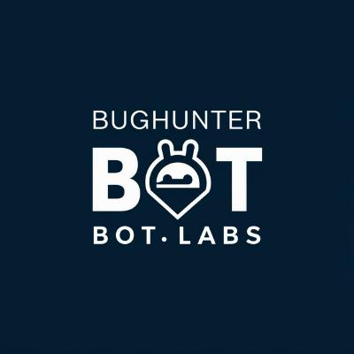

# BugHunter Bot Labs 🤖💻

  

Welcome to BugHunterbot Labs, the ultimate playground for cutting-edge bot development! 🚀 Brace yourselves for a captivating journey through the realms of automation, intelligence, and coding wizardry. 🧙‍♂️

At BugHunterbot Labs, we fearlessly embrace the challenge of hunting down those pesky bugs 🐞 and crafting ingenious bots that streamline processes, unleash productivity, and bring a touch of magic to the digital world. Our team of bot whisperers 💬 is constantly pushing the boundaries of what's possible, conjuring up innovative solutions that will leave you spellbound. 🪄

And that's just the tip of the iceberg! We're constantly cooking up new bot projects that will blow your mind. 🤯

## Join the Bot Revolution! 🤖🚀
If you're a coding enthusiast, a bot aficionado, or simply someone who appreciates cutting-edge technology, we invite you to join our bot-building adventures! Explore our repositories, contribute your ideas, and let's shape the future of bots together. 🌍

## Bot Development Services 🛠️
At BugHunterbot Labs, we take on freelance bot development projects for clients across various industries. Whether you need a custom chatbot, an automation solution, or an intelligent virtual assistant, our team of skilled bot builders is ready to bring your ideas to life. Let's collaborate and create a bot that revolutionizes your business! 💼

 

## Become a Sponsor 💖
Unleash the true potential of BugHunterbot Labs by becoming a sponsor! Your support will fuel our bot development endeavors, allowing us to tackle even more ambitious projects and push the boundaries of what's possible. Join our elite community of sponsors and gain exclusive access to behind-the-scenes updates, early previews, and more. 🎉

So, what are you waiting for? Dive into the world of BugHunterbot Labs and let's embark on an unforgettable bot-building journey! 🚀
